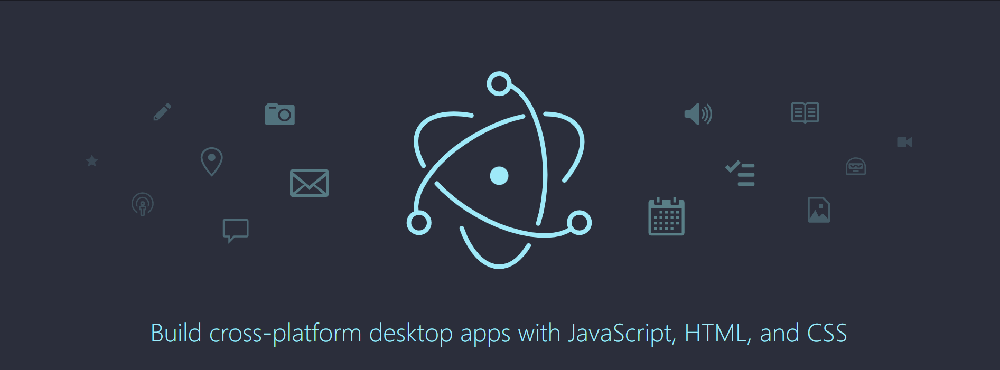

Electron is cross-platform apps. It supports many operating system desktop application such as  window, linux and Mac <br>
If you would like to know more, check the [Official website](https://www.electronjs.org/).


# Getting Started on development
In this post, I will use the Vue 3. However, you are able to replace to vue to others like react

## Step 1 - Start project
If you want to see the official document, click the following <a href="https://vitejs.dev/guide/#scaffolding-your-first-vite-project">link</a>
```shell
yarn create vite my-first-electron --template vue-ts
```

## Step 2 - Add dependencies
We will download some dependencies for running electron

### Step 2.1 - Download electron
```
yarn add -D electron electron-builder @types/electron
yarn add electron-is-dev
```
- electron: electron module
- electron-builder: build helper for electron
- @types/electron: types of electron
- electron-is-dev: Check electron is dev mode

### Step 2.2 - Download developing and building
```
yarn add -D concurrently cross-env wait-on
```
- concurrently: Run multiple process, we will use it for dev
- cross-env: Change env option, we will use it for dev and build
- wait-on: Wait process until something finish, we will use it for dev

## Step 3 - Change config
### vite.config.ts
```
import { defineConfig } from 'vite'
import vue from '@vitejs/plugin-vue'

export default defineConfig({
  base: process.env.IS_DEV !== 'true' ? './' : '/',
  plugins: [vue()],
  build: {
    outDir: './dist/vue'
  }
})
```
#### Note
1. we will put the electron and vue file separately for build
2. base should be different dev and build

### package.json
```json
{
  ...
  "main": "./dist/app/main.js",
  "scripts": {
    "dev": "vite",
    "build": "vue-tsc --noEmit && vite build",
    "build:watch": "vite build --watch",
    "preview": "vite preview",
    "electron:build": "tsc -p src/main/tsconfig.json",
    "electron:dev": "concurrently -k \"yarn dev\" \"yarn electron:build && yarn electron . \"",
    "electron:build-watch": "concurrently -k \"yarn build:watch\" \"yarn electron:build && yarn electron . \"",
    "app:build": "cross-env ELECTRON=true && yarn build && yarn electron:build && electron-builder",
    "app:publish": "yarn electron:build && yarn build:for:electron && yarn electron:builder-publish",
    ...
  }
}
```
#### Note
1. Add the "main" key for electron .
2. "app:publish" is for publishing to the Github with tags

### tsconfig.json
```json
{
  "compilerOptions": {
    "target": "esnext",
    "useDefineForClassFields": true,
    "module": "esnext",
    "moduleResolution": "node",
    "strict": true,
    "jsx": "preserve",
    "sourceMap": true,
    "resolveJsonModule": true,
    "isolatedModules": true,
    "esModuleInterop": true,
    "lib": ["esnext", "dom"],
    "skipLibCheck": true
  },
  "include": ["src/renderer/**/*.ts", "src/renderer/**/*.d.ts", "src/renderer/**/*.tsx", "src/renderer/**/*.vue"],
  "exclude": ["src/main/**/*.ts", "src/main/**/*.d.ts"],
  "references": [{ "path": "./tsconfig.node.json" }]
}

```

## Step 4 - Add electron file
Move all fies relative with vue under src/renderer. We will handle electron and vue files separately. <br>
Make the directory named "main" under src, and then create tsconfig.json and main.ts <br>
detach following codes on proper file
### tsconfig.json
```json
{
  "compilerOptions": {
    "target": "esnext",
    "useDefineForClassFields": true,
    "module": "esnext",
    "moduleResolution": "node",
    "strict": true,
    "jsx": "preserve",
    "sourceMap": true,
    "resolveJsonModule": true,
    "isolatedModules": true,
    "esModuleInterop": true,
    "lib": ["esnext", "dom"],
    "skipLibCheck": true
  },
  "include": ["src/renderer/**/*.ts", "src/renderer/**/*.d.ts", "src/renderer/**/*.tsx", "src/renderer/**/*.vue"],
  "exclude": ["src/main/**/*.ts", "src/main/**/*.d.ts"],
  "references": [{ "path": "./tsconfig.node.json" }]
}
```
### main.ts
```typescript
import { app, BrowserWindow } from 'electron'
import isDev from 'electron-is-dev'
import path from 'path'

let appWindow: BrowserWindow | undefined

const createWindow = () => {
  // Create the browser window.
  appWindow = new BrowserWindow({
    width: 1280,
    height: 720,
    webPreferences: {
      nodeIntegration: true
    }
  })

  appWindow.loadURL(isDev ? 'http://localhost:3000' : `file://${path.join(__dirname, '../vue/index.html')}`)
  appWindow.webContents.openDevTools()
}

app.whenReady()
  .then(async () => {
    createWindow()

    app.on('activate', () => {
      if (!BrowserWindow.getAllWindows().length) {
        createWindow()
      }
    })
  })

/* When app is ready to open */
app.on('ready', () => {
  console.log('App is ready to start')
})

app.on('window-all-closed', () => {
  if (process.platform !== 'darwin') {
    app.quit()
  }
})
```
#### Note
1. We will load different file or url based on dev mode.

## Step 4 - run on development
```shell
yarn electron:dev
```
Your app will be opened automatically

# Build your app
## Step 1 - change package.json
Add following code in package.json
```
"build": {
    "appId": "com.my-website.my-frist-electron",
    "productName": "My-first-electron",
    "copyright": "Copyright © 2022 ${author}",
    "publish": [
      {
        "provider": "github",
        "owner": "kkan0615",
        "repo": "my-personal-manger"
      }
    ],
    "mac": {
      "category": "public.app-category.utilities"
    },
    "win": {
      "publish": [
        "github"
      ],
      "target": [
        "zip",
        "nsis"
      ]
    },
    "nsis": {
      "oneClick": false,
      "allowToChangeInstallationDirectory": true
    },
    "files": [
      "dist/**/*",
      "src/main/**/*"
    ],
    "directories": {
      "buildResources": "assets",
      "output": "dist_electron"
    }
  },
```

## Step 2 - run the code
```
yarn electron:build
```
After some minutes, you can see dist_electron under your project.


# Conclusion
I try to make the electron app in easy way. Enjoy your electron code world!

# References
1. https://github.com/lod61/reminder-app
2. https://dev.to/brojenuel/vite-vue-3-electron-5h4o
3. https://dev.to/olyno/how-to-create-an-electron-application-with-vite-im

# Support
[](https://www.buymeacoffee.com/youngjinkwak)
