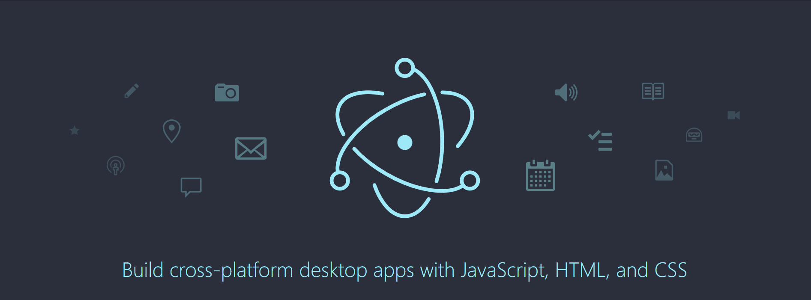

# Overview

When we create desktop app, sometime, multiple windows are required for any reasons. It could be to create multiple static html files and  load them. However, this way is hard to be handled on Development environment. Hence, this post will control multiple windows with URL

In this post, I am using electron 8, Vue3, Vite and Vue router 4.

# web Hash history mode vs web history
Before starting, Knowing vue router 4 history option is very important. Usually when we create web with vue, we use web history mode. The reason why we use web history mode is web hash history mode has a bad impact in SEO. However, web history does not. <br>
Luckily, In the electron desktop app, SEO is not required.
<br>
If you would like to know more, here is official site for vue-router v4 (<a href="https://router.vuejs.org/guide/essentials/history-mode.html#hash-mode">link</a>)


# Dive into code

## Electron
### First window Example
```typescript
import { BrowserWindow } from 'electron'
import isDev from 'electron-is-dev'
import path from 'path'

export let testOne: BrowserWindow | undefined

export const createTestOneWindow = async () => {
  // Create the browser window.
  testOne = new BrowserWindow({
    autoHideMenuBar: true,
    width: 1280,
    height: 720,
    webPreferences: {
      webviewTag: false,
      preload: path.join(__dirname, '../preload/index.cjs'),
    },
  })

  const pageUrl = import.meta.env.DEV
    ? 'http://localhost:3000'
    : new URL('../dist/renderer/index.html', `file://${__dirname}`).toString()

  await testOne.loadURL(pageUrl)
}

```
### Second window Example
```typescript
import { BrowserWindow } from 'electron'
import isDev from 'electron-is-dev'
import path from 'path'

export let testTwoWindow: BrowserWindow | undefined

export const createTestTwoWindow = async () => {
  // Create the browser window.
  testTwoWindow = new BrowserWindow({
    autoHideMenuBar: true,
    width: 1280,
    height: 720,
    webPreferences: {
      webviewTag: false,
      nodeIntegration: true,
      contextIsolation: false,
      preload: path.join(__dirname, '../preload/index.cjs'),
    },
  })

  const pageUrl = import.meta.env.DEV
    ? 'http://localhost:3000/#/testTwo'
    : new URL('../dist/renderer/index.html#testTwo', `file://${__dirname}`).toString()

  await testTwoWindow.loadURL(pageUrl)
}
```

### Note

- In dev environment, easily add page path end of localhost:{port}.
- In production environment, index.html#{whatever-name} will redirect page to page including whatever-name as route path without "/". The default (no #) points to /.

## Vue-router index

```typescript
import { createRouter, createWebHashHistory, RouteRecordRaw } from 'vue-router'

export const routes: RouteRecordRaw[] = [
  {
    path: '/',
    name: 'TestOneIndex',
    component: () => import('@/views/TestOne/index.vue'),
  },
  {
    path: '/testTwo',
    name: 'TestTwoIndex',
    component: () => import('@/views/TestTwo/index.vue'),
  },
]

const router = createRouter({
  // IMPORTANT
  history: createWebHashHistory('/'),
  routes,
})

export default router

```

### Note
- Use web Hash history mode not web history mode for history option
- The reason to use “./” is it’s electron

# Conclusion
The important thing is using hash mode instead of web history mode.

# Support
[](https://www.buymeacoffee.com/youngjinkwak)
