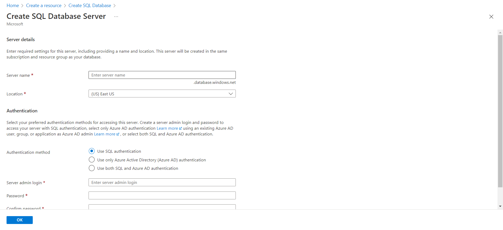

In this quickstart, you create the Azure SQL Database using Azure portal.
In addition, you will add your current Ip Address to white list.

[Official azure database link](https://azure.microsoft.com/en-ca/free/cosmos-db/search/?&ef_id=CjwKCAjwoMSWBhAdEiwAVJ2ndmGrePZZiNQYQ7AgyA5Cefr1JwxycghnEqAIzg5NtQwh_CpubPc-qxoCq5oQAvD_BwE:G:s&OCID=AIDcmmqz3gd78m_SEM_CjwKCAjwoMSWBhAdEiwAVJ2ndmGrePZZiNQYQ7AgyA5Cefr1JwxycghnEqAIzg5NtQwh_CpubPc-qxoCq5oQAvD_BwE:G:s&gclid=CjwKCAjwoMSWBhAdEiwAVJ2ndmGrePZZiNQYQ7AgyA5Cefr1JwxycghnEqAIzg5NtQwh_CpubPc-qxoCq5oQAvD_BwE)

# Getting started
## Step 1
Navigate to the azure portal, [link](https://portal.azure.com).  
If you don't have account yet, register azure first!

## Step 2

- Click the "+ create resource" on the tab

## Step 3

- Select SQL Database or click "create" under SQL Database

## Step 4

- Select proper subscription
- Create new resource group or select group that you already have
- Type database name. The database name should be unique, so if someone already uses the name, you will have to pick another.
- If you don't have any SQL server, you will have to create a new server.
  - If you already have SQL Server, skip the step 5.
  - If you would like to keep your money, you must change compute + storage.
    - Go to step 6
- Choose Locally-redundant backup storage
- Press button "Review + create"

## Step 5

- Type server name
- Select location, I suggest you to choose location near your residence.
  - Make sure that both web app and database are in the same region for better performance
- Use SQL Authentication for Authentication method
  - this option will login with SQL Sever admin ID, not your Azure account ID
  - You also can use the other options.
- Fill leftover inputs with proper data

## Step 6

- Click "Configure database"
- In service tier select box, select "Basic, for less demanding workloads"
  - This option will provide a database for 5$(USD) per month
- Press the "Apply" button

## Step 7

- Check your output

# Firewalls and Whitelists
Your database is protected by a firewall. To develop in your local, you will need to add your current IP Address to whitelist.

## Step 1

- Go to your database, and click "Set server firewall" on the wall

## Step 2

- Click "+ Add your client IPv4 address"
- After clicking, check your current Ipd address in table
- Press the "Save" button

# Conclusion
Now, you have your database with sql sever.

# Support

