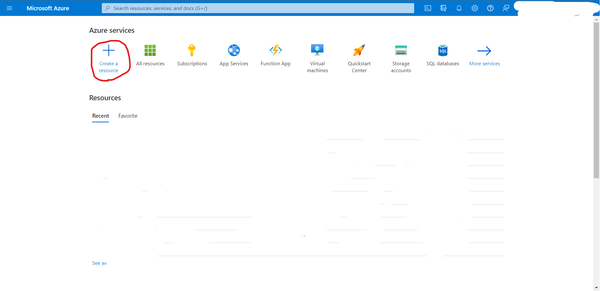

In this quickstart, you create blob storage  
[Microsoft official document](https://docs.microsoft.com/en-us/azure/storage/blobs/storage-blobs-introduction)

# Getting started
## Step 1
Navigate to the azure portal, [link](https://portal.azure.com).  
If you don't have account yet, register azure first!

## Step 2

- Click the "+ create resource" on the tab

## Step 3

- Select "Storage account" or "create" under it

## Step 4

- Select proper subscription
- Create new resource group or select group that you already have
- Type storage account name. This field can contain only lowercase letters and numbers and must be between 3 and 24 characters.
- Select your Region
- If you would like to low price of blob storage, go to step 5.
- Press button "Review + create"

## Step 5
This step is talking about low price of blob. If you don't need it goes to next step

- In Redundancy, "select locally-redundant storage (LRS") option
- Go to advanced tab
- Change access tier to Cool

## Step 6

- Check your output

# How to get access keys

- In the left drawer, find security + networking
- Click "access keys" menu

# Conclusion
In container menu, you can see the files that you upload

# Support

