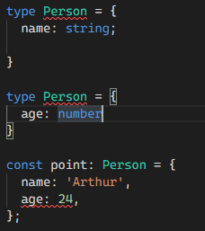
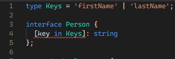

---
[//]: # (![typescript-logo]&#40;../images/typescript-logo.png&#41;)
This post is written under v4.7.4. You can test all code following link [playground](https://www.typescriptlang.org/play#example/types-vs-interfaces)
# Interface and Type
## Both can have "Name"
### Interface
```typescript
interface Point {
  x: number;
  y: number;
}

const point: Point = {
  x: 1,
  y: 20,
};
```
### Type
```typescript
type Point = {
  x: number;
  y: number;
};

const point: Point = {
  x: 1,
  y: 20,
};
```

# Interface vs Type
## merging
At the most basic level, the merge mechanically joins the members of both declarations into a single interface with the same name.
See more [offical](https://www.typescriptlang.org/docs/handbook/declaration-merging.html)
### Interface
```typescript
interface Person {
  name: string;
}

interface Person {
  age: number
}

const point: Person = {
  name: 'Arthur',
  age: 24,
};
```
### Type
Merging does not work with types. If you attempt to do it. You will get ```Duplicate identifier``` error <br>


## Type have "Intersection"
Intersection combines multiple types into a single one type with ```&``` keyword.
```typescript
type Name = {
  name: string
};

type Age = {
  age: number
};

type Person = Name & Age;

const point: Person = {
  name: 'Arthur',
  age: 24,
};
```

## Type have "Union"
Union creates a new type that can have a value of one or a few more types
```typescript
type Width = string | number;

const boxWidth: Width = 20;
const containerWidth: Width = '20px';
```

## Type can have "Tuple"
Tuple can contain two values of different data types. <br>
See more [official](https://www.tutorialsteacher.com/typescript/typescript-tuple)
```typescript
type Person = [number, string, boolean];

const person: Person = [1, 'Arthur Morgan', true];
```
If you want to use in interface, you need to write the code like following example.
```typescript
type Value = [number, string, boolean];

interface Persion {
  value: Value
}
```
The reason is interface can not have tuple directly.

## Type can use "computed properties"
The computed properties are number and symbol named properties in index types and mapped types
### Types
```typescript
type Keys = 'firstName' | 'lastName';

type Person = {
  [key in Keys]: string
};

const test: Person = {
  firstName: "Arthur",
  lastName: "Morgan"
};
```
### Interface
Interface doesn't allow us to use computed properties. You will get ```A mapped type may not declare properties or methods.``` error <br>


# When should we use?
It depends on what you’re building and what you’re working on.
## Interface
- When you need to define new object type.
- When you create Public API, using interface is a better way in order to merge.
## Types
- When you need to use feature that only Type have such as tuple, Intersection, Tuple and computed properties

# Ref
- https://yceffort.kr/2021/03/typescript-interface-vs-type
- https://medium.com/humanscape-tech/type-vs-interface-%EC%96%B8%EC%A0%9C-%EC%96%B4%EB%96%BB%EA%B2%8C-f36499b0de50
- https://guiyomi.tistory.com/109
- https://pawelgrzybek.com/typescript-interface-vs-type/
- https://velog.io/@youngjewoo/TypeScript-union%EA%B3%BC-intersection%EC%9D%98-%EC%B0%A8%EC%9D%B4
- https://blog.logrocket.com/types-vs-interfaces-in-typescript/
- https://www.typescripttutorial.net/typescript-tutorial/typescript-tuple/
- https://www.tutorialsteacher.com/typescript/typescript-tuple

# Support
[](https://www.buymeacoffee.com/youngjinkwak)
